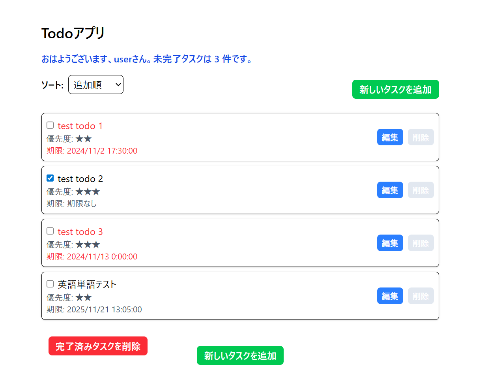
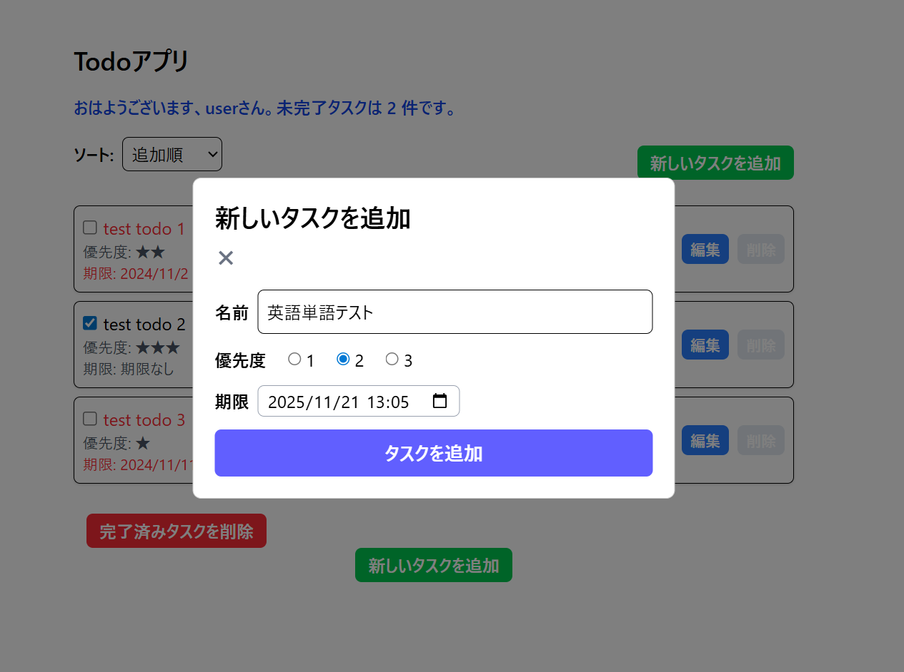
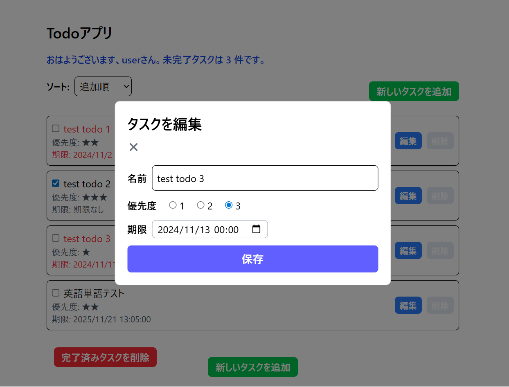

# TodoApp

React、TypeScript、Tailwind CSS 、Modalを使用し、ローカルストレージでデータを永続化した「Todoアプリ」です。

## アプリのurl

https://nagaoka125.github.io/my-react-todo-app/

## アプリの説明

このアプリは基本的なTodoアプリとして使用できるように作製しました。
タスク追加にはモーダルを使用し、ボタンを押すことでタスク追加が表示されるようにしてなるべくタスクを見やすく表示するようにしました。
分からない部分やエラーについてはインターネットで検索したり、AIに聞いたりして解決しました。

以下にアプリの機能を箇条書きで示します。
- タスクの追加、編集、削除
- タスクの優先度設定（1〜3の3段階）
- タスクの期限設定と期限切れの視覚的な表示
- タスクの完了状態の管理
- ソート機能（追加順、期限順、優先度順）
- 未完了・完了済みタスクのフィルタリング
- ローカルストレージを使用したデータの永続化

## アプリのスクリーンショット

### アプリ全体の画面

### タスク追加モーダル

### タスク編集モーダル

## 開発期間

2025年10月23日 ~ 2025年11月20日 (17時間)

## ライセンス

MIT License

Copyright (c) 2025 nate

Permission is hereby granted, free of charge, to any person obtaining a copy
of this software and associated documentation files (the "Software"), to deal
in the Software without restriction, including without limitation the rights
to use, copy, modify, merge, publish, distribute, sublicense, and/or sell
copies of the Software, and to permit persons to whom the Software is
furnished to do so, subject to the following conditions:

The above copyright notice and this permission notice shall be included in all
copies or substantial portions of the Software.

THE SOFTWARE IS PROVIDED "AS IS", WITHOUT WARRANTY OF ANY KIND, EXPRESS OR
IMPLIED, INCLUDING BUT NOT LIMITED TO THE WARRANTIES OF MERCHANTABILITY,
FITNESS FOR A PARTICULAR PURPOSE AND NONINFRINGEMENT. IN NO EVENT SHALL THE
AUTHORS OR COPYRIGHT HOLDERS BE LIABLE FOR ANY CLAIM, DAMAGES OR OTHER
LIABILITY, WHETHER IN AN ACTION OF CONTRACT, TORT OR OTHERWISE, ARISING FROM,
OUT OF OR IN CONNECTION WITH THE SOFTWARE OR THE USE OR OTHER DEALINGS IN THE
SOFTWARE.